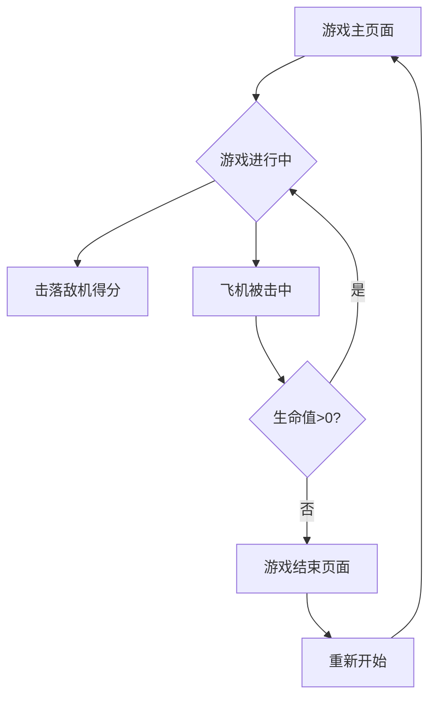

## 1. Product Overview
简易飞机大战网页游戏，玩家控制飞机躲避敌机并射击得分。这是一个轻量级的在线游戏，无需下载安装，通过浏览器即可游玩，适合休闲娱乐。

目标用户：喜欢简单射击游戏的玩家，适合所有年龄段。产品价值：提供即时的游戏娱乐体验，展示网页游戏开发技术。

## 2. Core Features

### 2.1 User Roles
| Role | Registration Method | Core Permissions |
|------|---------------------|------------------|
| Player | 无需注册，直接游玩 | 开始游戏、控制飞机、查看分数 |

### 2.2 Feature Module
游戏包含以下核心页面：
1. **游戏主页面**：游戏画布、飞机控制、敌机生成、子弹射击、分数显示。
2. **游戏结束页面**：显示最终分数、重新开始按钮。

### 2.3 Page Details
| Page Name | Module Name | Feature description |
|-----------|-------------|---------------------|
| 游戏主页面 | 游戏画布 | 显示游戏画面，包括背景、飞机、敌机、子弹等元素 |
| 游戏主页面 | 飞机控制 | 使用键盘方向键或WASD控制飞机移动，空格键射击 |
| 游戏主页面 | 敌机生成 | 随机生成敌机从顶部向下移动，速度随机 |
| 游戏主页面 | 子弹系统 | 飞机发射子弹向上飞行，击中敌机得分 |
| 游戏主页面 | 碰撞检测 | 检测飞机与敌机、子弹与敌机的碰撞 |
| 游戏主页面 | 分数系统 | 击落敌机获得分数，实时显示当前分数 |
| 游戏主页面 | 生命值 | 飞机被击中减少生命值，生命值为0时游戏结束 |
| 游戏结束页面 | 分数展示 | 显示本局最终分数 |
| 游戏结束页面 | 重新开始 | 点击按钮重新开始游戏 |

## 3. Core Process
玩家访问游戏页面后直接开始游戏：
1. 玩家进入游戏主页面，游戏自动开始
2. 使用键盘控制飞机移动和射击
3. 击落敌机获得分数，躲避敌机攻击
4. 飞机被击中3次后游戏结束
5. 显示最终分数，可选择重新开始

## 4. User Interface Design
### 4.1 Design Style
- 主色调：深蓝色背景（#001a33）配亮色游戏元素
- 按钮样式：圆角矩形，悬停效果
- 字体：无衬线字体，分数显示使用大字号（24px+）
- 布局：全屏游戏画布，顶部显示分数和生命值
- 图标风格：简洁的几何形状，使用CSS绘制

### 4.2 Page Design Overview
| Page Name | Module Name | UI Elements |
|-----------|-------------|-------------|
| 游戏主页面 | 游戏画布 | 全屏Canvas，深蓝色星空背景，顶部状态栏显示分数和生命值 |
| 游戏主页面 | 飞机精灵 | 三角形绿色飞机，位于底部中央，响应键盘控制 |
| 游戏主页面 | 敌机精灵 | 红色矩形敌机，从不同X坐标下降，带简单动画效果 |
| 游戏主页面 | 子弹效果 | 黄色小圆点，向上快速移动，带拖尾效果 |
| 游戏结束页面 | 结束面板 | 半透明黑色遮罩，居中显示最终分数和重新开始按钮 |

### 4.3 Responsiveness
桌面优先设计，支持键盘控制。同时支持移动端触摸控制，适配不同屏幕尺寸，保持游戏画面比例。