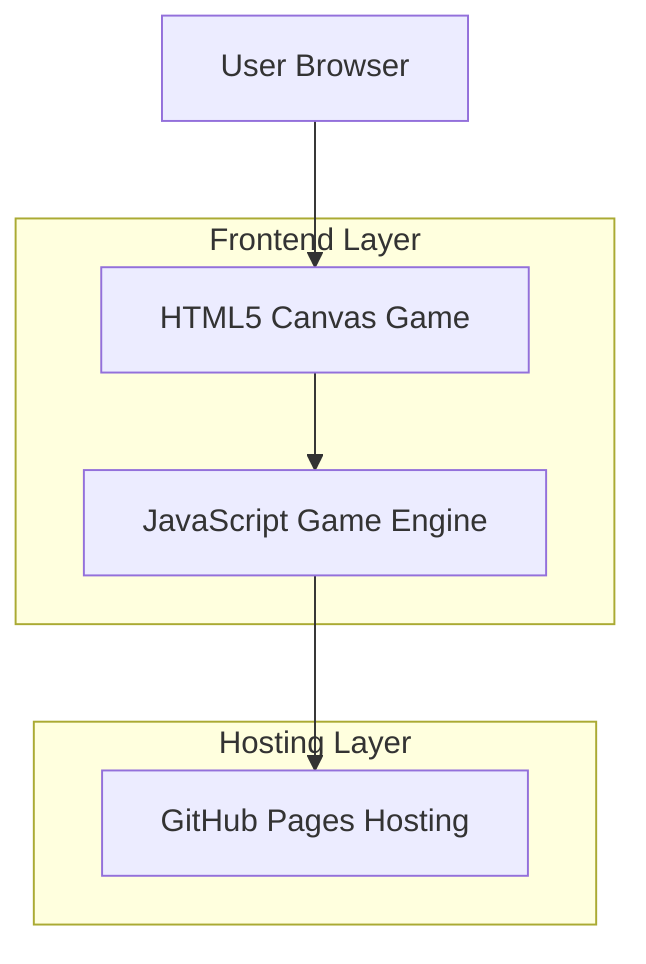

## 1. Architecture design



## 2. Technology Description
- Frontend: HTML5 + CSS3 + JavaScript (ES6+)
- 游戏引擎：原生Canvas API
- 部署平台：GitHub Pages
- 无后端依赖，纯静态网页游戏

## 3. Route definitions
| Route | Purpose |
|-------|---------|
| /index.html | 游戏主页面，包含完整的游戏逻辑 |
| /style.css | 游戏样式文件 |
| /game.js | 游戏核心逻辑文件 |

## 4. API definitions
无后端API，游戏完全在前端运行。

## 5. Server architecture diagram
无服务器架构，纯静态文件托管。

## 6. Data model
无数据库，游戏数据存储在内存中：

### 6.1 游戏状态数据结构
```javascript
// 游戏状态对象
gameState = {
  score: 0,        // 当前分数
  lives: 3,        // 剩余生命
  level: 1,        // 当前关卡
  isGameOver: false, // 游戏结束状态
  isPaused: false   // 游戏暂停状态
}

// 飞机对象
player = {
  x: canvas.width / 2,
  y: canvas.height - 60,
  width: 40,
  height: 40,
  speed: 5
}

// 敌机数组
enemies = [
  {
    x: randomX,
    y: -enemyHeight,
    width: 30,
    height: 30,
    speed: randomSpeed
  }
]

// 子弹数组
bullets = [
  {
    x: bulletX,
    y: bulletY,
    width: 4,
    height: 10,
    speed: 8
  }
]
```

## 部署说明
1. 创建GitHub仓库
2. 上传游戏文件（index.html, style.css, game.js）
3. 启用GitHub Pages功能
4. 设置主分支为发布源
5. 通过 {username}.github.io/{repository-name} 访问游戏